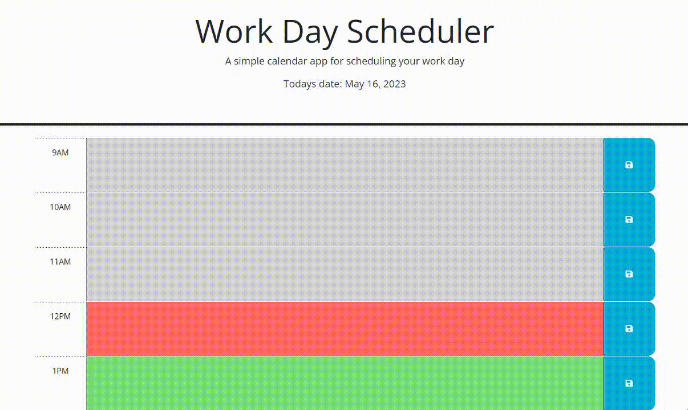

# Work Day Scheduler

A daily planner that updates dynamically using jQuery, Day.js, and Bootstrap.

---

## Description

This webapp allows you to schedule your work day on an hourly basis by entering in and saving that text. The color of each of the days will change color based on time of day denoting past, present, and future. 

Everything behind the scenes making the webapp function is done using jQuery and JavaScript to write and use data from your browsers local storage.

Writing the logic behind this project helped reinforce basic jQuery syntax and utilization of local storage.

---
## Installation

N/A

---
## Usage

Project repository: [Click me (you're already here)](https://github.com/t-willis/work-day-scheduler)

Deployed application: [Click me](https://t-willis.github.io/work-day-scheduler/)

---

The background color of each element changes based on the time of day. Grey denotes past, red denotes current, and green denotes future.

To use this webapp all you have to do is type whatever you want in the hourly text-boxes and click the save button to the right. Any time you refresh your browser or return to the page the previously entered text will re-populate the appropriate field.

If you want to clear all text-boxes, at the beginning of a new day for example, all you have to do is click the red button at the bottom right of the page. A prompt will appear and you can confirm or deny the function happening.

---